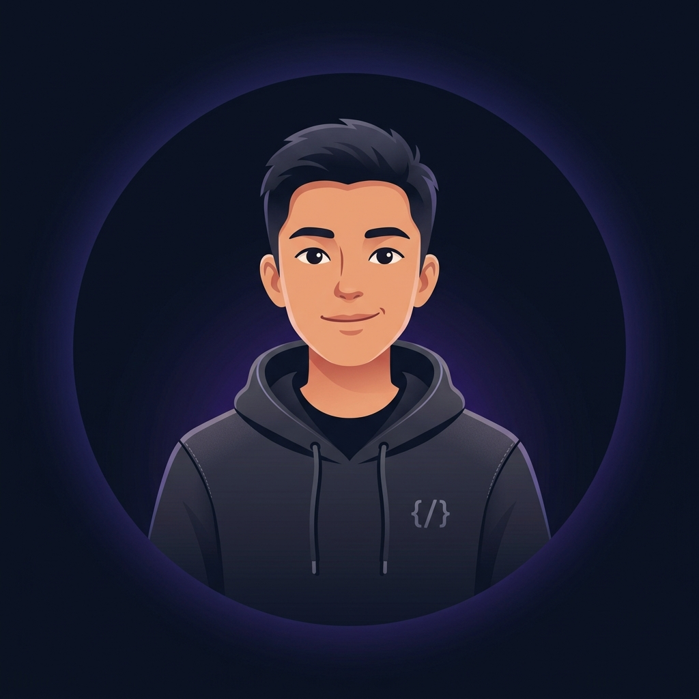

# 🚀 Modern & Bilingual Personal Portfolio Website

Welcome to my personal developer portfolio! This repository showcases my technical skills, professional experiences, and software engineering projects. Built with **Next.js 14 (App Router)**, **Framer Motion**, and **Vanilla CSS Modules**, this portfolio is designed to look premium, fast, and highly interactive.

---

## ✨ Features

- **🌐 Dynamic Bilingual Support (ID/EN)**: Powered by React Context API, allowing users to toggle between Bahasa Indonesia and English instantly without page reloads.
- **🎨 Glassmorphic Premium Design**: Sleek dark mode aesthetics featuring a floating particles background on HTML5 Canvas, mesh gradients, and elegant hover animations.
- **📱 Fully Responsive**: Tailored grid layouts optimized for all viewports—from mobile devices to ultra-wide desktop monitors.
- **📅 Interactive Timeline**: A detailed visual history highlighting my internship experiences, complete with ownership details and tech stack tags.
- **🌟 Featured Projects Showcase**: Showcases production-ready platforms (like WA Gateway SaaS and Mock API Generator) with direct GitHub links.
- **📈 Production Optimized**: Prerendered static routing for near-instantaneous page loads and optimal SEO.

---

## 🛠️ Tech Stack & Libraries

- **Framework**: [Next.js 14](https://nextjs.org/) (App Router)
- **Styling**: Vanilla CSS (CSS Variables + CSS Modules)
- **Animations**: [Framer Motion](https://www.framer.com/motion/)
- **Icons**: [Lucide React](https://lucide.dev/)
- **Design Pattern**: Glassmorphism & Accent Glows

---

## 📸 Preview

### Desktop View
The home page features an interactive canvas background with floating developer status tags, and statistical metrics highlighting key achievements.

<p align="center">
  
</p>

---

## ⚙️ Running Locally

Follow these steps to set up and run the portfolio on your local machine:

1. **Clone the repository**
   ```bash
   git clone https://github.com/Akbardwi123/akbar-portfolio-.git
   cd akbar-portfolio-
   ```

2. **Install dependencies**
   ```bash
   npm install
   ```

3. **Start the development server**
   ```bash
   npm run dev
   ```

4. **Build for production**
   ```bash
   npm run build
   ```

---

## 📁 Project Structure

```bash
/src
├── app/               # Next.js App Router (pages & global layouts)
├── components/        # Reusable sections (Hero, About, Projects, etc.)
├── context/           # Language translation provider state
└── data/              # portfolio.ts (central bilingual content data source)
```

---

## 📞 Get In Touch

I am actively looking for **Junior Web Developer** roles (Laravel / Node.js). Let's connect!

- **Email**: akbardwipebriansyah@gmail.com
- **WhatsApp**: [+6281212845581](https://wa.me/6281212845581)
- **GitHub**: [@Akbardwi123](https://github.com/Akbardwi123)
